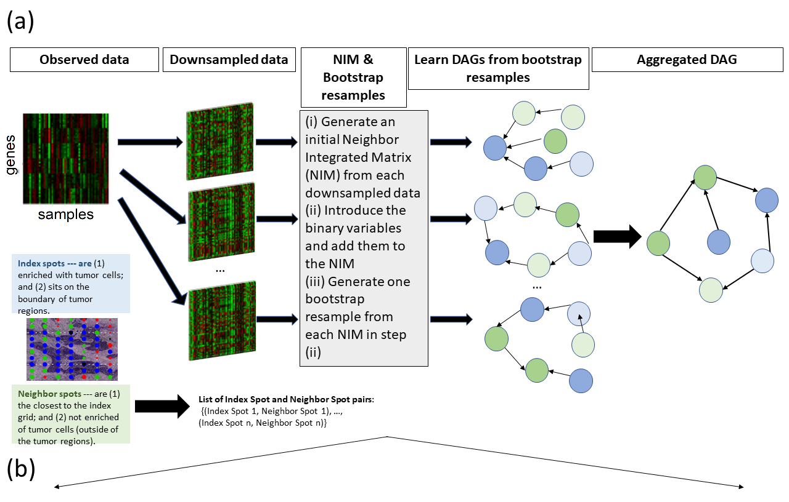
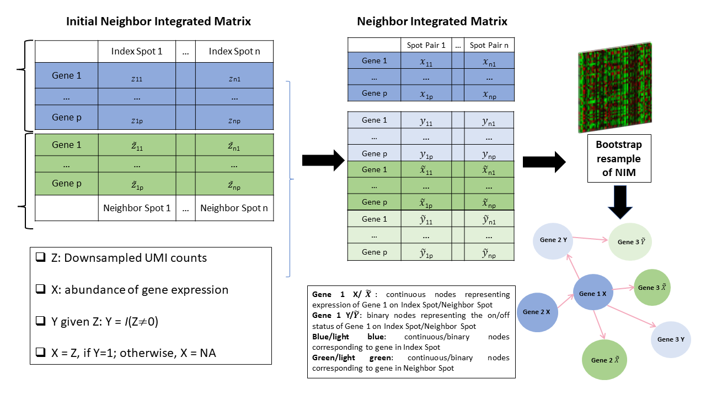

## LRnetSTv2: Learning Directed Acyclic Graphs for Ligands and Receptors based on Spatial Transcriptomics Data





- [Reference](#Reference)
- [Overview](#Overview)
- [Installation](#Installation)
- [Usage](#Usage)
- [Arguments](#Arguments)
- [Value](#Value)
- [Examples](#Examples)
- [Comparison with LRnetST](#Comparison)
- [Contributions](#Contributions)

## Reference

Shrabanti Chowdhury, Sammy Ferri-Borgogno, Peng Yang, Wenyi Wang, Jie Peng, Samuel C Mok, Pei Wang.
Learning directed acyclic graphs for ligands and receptors based on spatially resolved transcriptomic data of ovarian cancer.
Briefings in Bioinformatics, Volume 26, Issue 2, March 2025, https://doi.org/10.1093/bib/bbaf085

## Overview

LRnetSTv2 is an improved implementation of LRnetST for learning directed acyclic graphs (DAGs) from spatial transcriptomics (ST) data. The data contain mixed continuous (log-transformed count) and binary (on/off indicator) nodes, with zero-inflation modelled explicitly via paired node structures.

Key improvements over LRnetST:
- **~5.7× faster single HC run** via score caching (add/delete/reverse caches with version stamps) and precomputed row-selection masks
- **~3.1× faster bootstrap** (50 resamples: 406 s vs 1269 s on the example dataset)
- **Correctness fix**: constant columns arising from row-selection after whitelisting indicator → logcount parents are silently dropped, keeping the design matrix full-rank
- **Acyclicity cache bug fix**: double-`if` in the reverse-operation update block replaced with `if/else if`; prevents a cache entry from being incorrectly set to `true` after already being set to `false`
- **Reproducible RNG**: per-run `mt19937` generator replaces global `srand/rand`; results are fully reproducible across platforms
- **Unified parallel bootstrap**: `hcSC_boot(n.thread=)` replaces the separate `hcSC_boot_parallel` function; uses the `future` backend

## Installation

```r
library(devtools)
install_github("jie108/LRnetST", subdir="LRnetSTv2")
```

or alternatively

```r
install.packages("remotes")
remotes::install_github("jie108/LRnetST", subdir="LRnetSTv2")
```

## Usage

```
SC_prepare: Prepare a log-count ST matrix for hcSC / hcSC_boot by creating paired
  (logCount, indicator) node structure with whitelisted indicator → logcount edges.

LRnetSTv2::SC_prepare(logCount)


hcSC: Learn a DAG from ST data (no bootstrap) by hill climbing for mixtures of
  continuous and binary variables.

LRnetSTv2::hcSC(Y, nodeType, whiteList, blackList, scale, tol, maxStep, restart, seed, verbose)


hcSC_boot: Learn a DAG from each bootstrap resample of the ST data; supports
  parallel execution via the future backend.

LRnetSTv2::hcSC_boot(Y, n.boot, nodeType, whiteList, blackList, scale, tol, maxStep,
                     restart, seed, nodeShuffle, bootDensityThre, n.thread, verbose)


score_shd: Aggregate an ensemble of DAGs by minimising generalised structural
  Hamming distance (gSHD).

LRnetSTv2::score_shd(boot.adj, alpha, threshold, whitelist, blacklist, max.step, verbose)
```

## Arguments

### Arguments for `SC_prepare`

| Parameter  | Description |
| :--------- | :---------- |
| logCount   | An n by p matrix of log-transformed count values (e.g. log2(count + 1)). Rows are spots/cells, columns are genes. |

### Arguments for `hcSC` and `hcSC_boot`

| Parameter | Default | Description |
| :-------- | :-----: | :---------- |
| Y | | An n by p data matrix: n – sample size, p – number of variables. When using the SC workflow, pass `prep$Y` from `SC_prepare`. |
| n.boot *(hcSC_boot only)* | 1 | Number of bootstrap resamples. |
| nodeType | NULL | A character vector of length p specifying node type: `"c"` for continuous, `"b"` for binary. When using `SC_prepare`, pass `prep$nodeType`. Defaults to all `"c"` when NULL. |
| whiteList | NULL | A p by p logical matrix; entry `[i,j] = TRUE` forces edge i → j into every learned DAG. When using `SC_prepare`, pass `prep$whiteList` (indicator_i → logcount_i edges). |
| blackList | NULL | A p by p logical matrix; entry `[i,j] = TRUE` forbids edge i → j. When using `SC_prepare`, pass `prep$blackList` (logcount_i → indicator_i edges). Diagonal is always blacklisted. |
| scale | TRUE | Logical: L2-normalise each continuous column so that `‖Y[,i]‖²/n = 1` (zero pattern is preserved). |
| tol | 1e-6 | Minimum BIC improvement required to accept a hill-climbing step. |
| maxStep | 2000 | Maximum number of hill-climbing steps per restart. |
| restart | 10 | Number of random restarts. The best-scoring DAG across all restarts is returned. |
| seed | 1 | Integer seed for the mt19937 random number generator (used for restart tie-breaking and, in `hcSC_boot`, for bootstrap resampling). |
| nodeShuffle *(hcSC_boot only)* | FALSE | Logical: randomly permute the node ordering before each bootstrap DAG search. |
| bootDensityThre *(hcSC_boot only)* | 0.1 | Minimum column-wise nonzero fraction allowed in any bootstrap resample (rejection sampling). Must be strictly between 0 and the lowest observed column nonzero rate. |
| n.thread *(hcSC_boot only)* | 1 | Number of parallel workers. `1` runs sequentially. Values > 1 launch a `future::multisession` plan with the requested number of workers. |
| verbose | FALSE | Logical: print step-by-step information. |

### Arguments for `score_shd`

| Parameter | Default | Description |
| :-------- | :-----: | :---------- |
| boot.adj | | A p by p by B numeric array of bootstrap adjacency matrices (B DAGs to aggregate). Typically the output of `hcSC_boot`. |
| alpha | 1 | Generalised SHD weight: `gSF(i,j) = SF(i,j) + (1 − α/2)·SF(j,i)`. Larger α produces more aggressive aggregation (fewer edges, lower FDR, lower power). |
| threshold | 0 | Frequency cut-off = `(1 − threshold)/2`. Edges with gSF ≤ cut-off are excluded. Default `0` corresponds to a cut-off of 0.5. |
| whitelist | NULL | A p by p 0/1 matrix: entry `[i,j] = 1` forces edge i → j into the aggregated DAG. |
| blacklist | NULL | A p by p 0/1 matrix: entry `[i,j] = 1` forbids edge i → j from the aggregated DAG. |
| max.step | NULL | Legacy parameter; has no effect. |
| verbose | FALSE | Logical: print edge-addition information. |

## Value

### Value for `SC_prepare`

A list with four components:

| Object    | Description |
| :-------- | :---------- |
| Y         | n by 2p matrix: `cbind(logCount, logCount > 0)`. Columns 1..p are continuous; columns p+1..2p are binary indicators. |
| nodeType  | Character vector of length 2p: `"c"` for columns 1..p, `"b"` for columns p+1..2p. |
| whiteList | 2p by 2p logical matrix with `whiteList[p+i, i] = TRUE` (indicator_i → logcount_i). |
| blackList | 2p by 2p logical matrix with `blackList[i, p+i] = TRUE` (logcount_i → indicator_i) and `TRUE` on the diagonal. |

### Value for `hcSC`

A list with four components:

| Object     | Description |
| :--------- | :---------- |
| adjacency  | p by p 0/1 integer matrix: the adjacency matrix of the learned DAG (`adj[i,j] = 1` means edge i → j). |
| score      | Numeric vector of BIC scores at each accepted hill-climbing step. |
| operations | Integer matrix recording the operation (1 = add, 2 = delete, 3 = reverse) and the two nodes involved at each step. |
| deltaMin   | Numeric vector of the minimum candidate score change evaluated at each step. |

### Value for `hcSC_boot`

A p by p by n.boot numeric array. Slice `[,,b]` is the 0/1 adjacency matrix of the DAG learned from bootstrap resample b.

### Value for `score_shd`

A p by p 0/1 integer matrix: the adjacency matrix of the aggregated DAG.

## Examples

```r
library(LRnetSTv2)

# ── Load example data (from LRnetST) ──────────────────────────────────────────
library(LRnetST)
data(example)
Y.n      <- example$Y      # 102 × 102 log-count matrix
true.dir <- example$true.dir

p <- ncol(Y.n)   # 102
n <- nrow(Y.n)   # 102

# ── (i) Prepare data for the SC workflow ──────────────────────────────────────
# SC_prepare creates paired (logCount, indicator) columns and sets white/blacklists.
prep <- LRnetSTv2::SC_prepare(Y.n)
# prep$Y        : 102 × 204  (102 continuous + 102 binary columns)
# prep$nodeType : "c" × 102, "b" × 102
# prep$whiteList: 102 whitelist entries  (indicator_i → logcount_i)

# ── (ii) Single-run DAG learning ──────────────────────────────────────────────
res <- LRnetSTv2::hcSC(
  Y         = prep$Y,
  nodeType  = prep$nodeType,
  whiteList = prep$whiteList,
  blackList = prep$blackList,
  scale     = TRUE,
  maxStep   = 1000,
  tol       = 1e-6,
  restart   = 10,
  seed      = 1,
  verbose   = FALSE
)
adj.single <- res$adjacency[1:p, 1:p]   # logCount block only

# ── (iii) Bootstrap DAG learning ──────────────────────────────────────────────
# Sequential (n.thread = 1):
boot.adj <- LRnetSTv2::hcSC_boot(
  Y              = prep$Y,
  n.boot         = 50,
  nodeType       = prep$nodeType,
  whiteList      = prep$whiteList,
  blackList      = prep$blackList,
  scale          = TRUE,
  tol            = 1e-6,
  maxStep        = 1000,
  restart        = 10,
  seed           = 1,
  nodeShuffle    = FALSE,
  bootDensityThre = 0.1,
  n.thread       = 1,
  verbose        = FALSE
)
# Parallel (e.g. 4 cores):
# boot.adj <- LRnetSTv2::hcSC_boot(..., n.thread = 4)

# ── (iv) Bootstrap aggregation ────────────────────────────────────────────────
adj.bag.full <- LRnetSTv2::score_shd(
  boot.adj,
  alpha     = 1,
  threshold = 0,
  whitelist = prep$whiteList
)
adj.bag <- adj.bag.full[1:p, 1:p]   # logCount block

# ── (v) Evaluation ────────────────────────────────────────────────────────────
## DAG
sum(adj.bag == 1 & true.dir == 0) / sum(adj.bag == 1)   # FDR:   0.3942
sum(adj.bag == 1 & true.dir == 1) / sum(true.dir == 1)  # Power: 0.5780

## Skeleton
true.ske   <- LRnetSTv2::skeleton(true.dir)
adj.bag.ske <- LRnetSTv2::skeleton(adj.bag)
sum(adj.bag.ske == 1 & true.ske == 0) / sum(adj.bag.ske == 1)  # FDR:   0.1442
sum(adj.bag.ske == 1 & true.ske == 1) / sum(true.ske == 1)     # Power: 0.8165

## Moral graph
true.moral   <- LRnetSTv2::moral_graph(true.dir)
adj.bag.moral <- LRnetSTv2::moral_graph(adj.bag)
sum(adj.bag.moral == 1 & true.moral == 0) / sum(adj.bag.moral == 1)  # FDR:   0.2160
sum(adj.bag.moral == 1 & true.moral == 1) / sum(true.moral == 1)     # Power: 0.6902

## V-structures
true.vstr   <- LRnetSTv2::vstructures(true.dir)
adj.bag.vstr <- LRnetSTv2::vstructures(adj.bag)
vstr.corr    <- LRnetSTv2::compare.vstructures(
  target.vstructures = adj.bag.vstr,
  true.vstructures   = true.vstr
)
1 - nrow(vstr.corr) / nrow(adj.bag.vstr)  # FDR:   0.3729
nrow(vstr.corr) / nrow(true.vstr)          # Power: 0.4805
```

## Comparison with LRnetST

Results on the built-in `example` dataset (`n = 102`, `p = 102`, 109 true edges). Both packages used `seed = 1`, `restart = 10`, `maxStep = 1000`. LRnetSTv2 (all-continuous) uses the same all-`"c"` node type as LRnetST for a direct speed comparison; LRnetSTv2 (SC workflow) uses `SC_prepare` for the intended mixed continuous/binary model.

### Timing

| | Single HC | Bootstrap (n.boot = 50, sequential) |
| :--- | ---: | ---: |
| LRnetST | 5.98 s | 1269 s |
| LRnetSTv2 (all-continuous) | **1.04 s** | **406 s** |
| LRnetSTv2 (SC workflow) | 8.33 s | 1209 s |

LRnetSTv2 is **5.7× faster** for a single HC run and **3.1× faster** for 50 bootstrap resamples (all-continuous). The SC workflow processes 2p = 204 nodes so it is slower per run, but it models the zero-inflation structure explicitly.

### Accuracy (bootstrap-aggregated DAG, n.boot = 50)

| Metric | LRnetST | LRnetSTv2 (all-continuous) | LRnetSTv2 (SC workflow) |
| :----- | :-----: | :------------------------: | :---------------------: |
| **DAG** | | | |
| FDR    | 0.4375 | 0.4250 | **0.3942** |
| Power  | 0.5780 | **0.6330** | 0.5780 |
| Edges  | 112    | 120    | 104    |
| **Skeleton** | | | |
| FDR    | 0.1786 | 0.2417 | **0.1442** |
| Power  | **0.8440** | 0.8349 | 0.8165 |
| **Moral graph** | | | |
| FDR    | 0.2414 | 0.3495 | **0.2160** |
| Power  | 0.7174 | **0.7283** | 0.6902 |
| **V-structures** | | | |
| FDR    | 0.3968 | 0.5517 | **0.3729** |
| Power  | 0.4935 | **0.5065** | 0.4805 |

The SC workflow (LRnetSTv2 with `SC_prepare`) consistently achieves the lowest FDR across all four metrics, at a modest cost in power. This is the recommended mode for ST data with significant zero-inflation.

## Contributions

If you find bugs or have suggestions, please email the maintainer at <jiepeng108@gmail.com>. Contributions (via pull requests or otherwise) are welcome.
