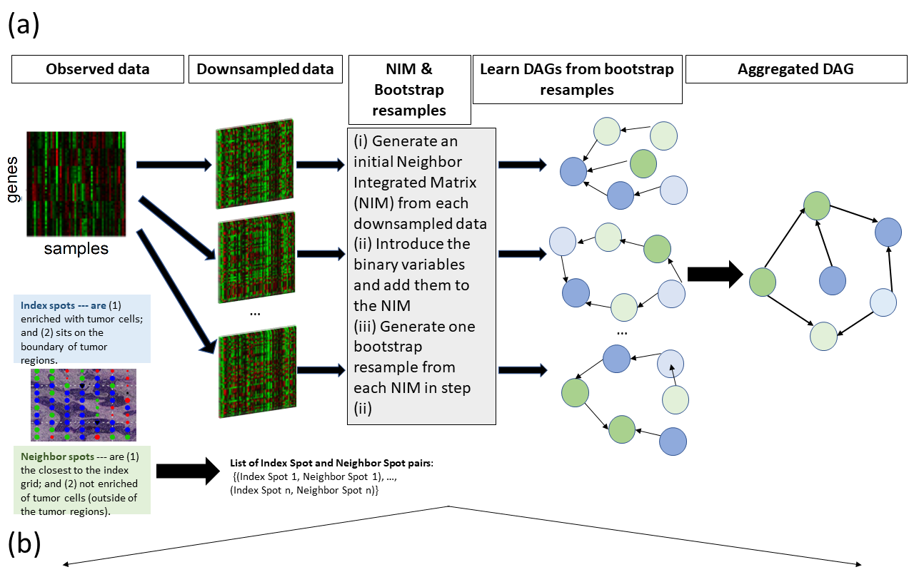
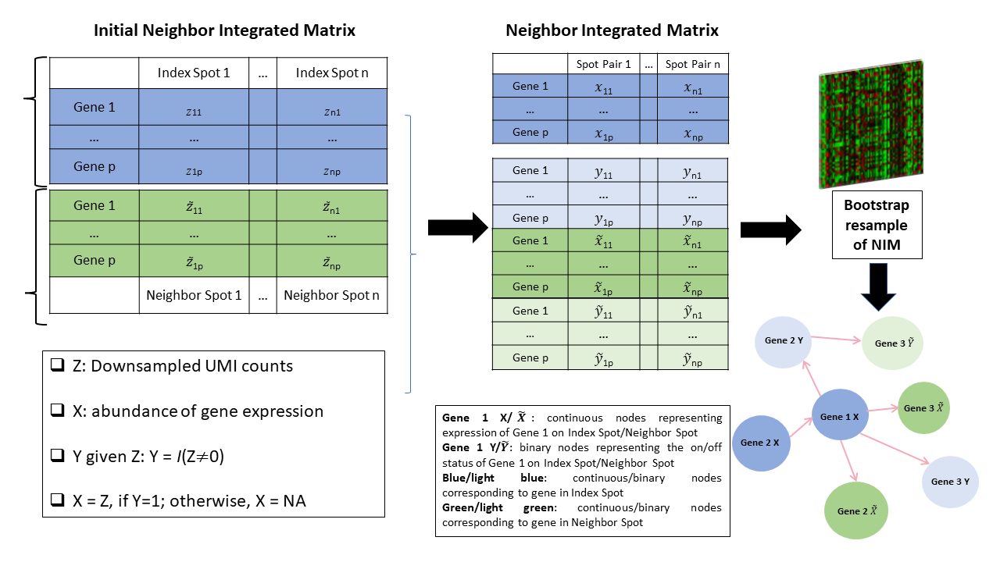

## LRSTNet: Learning Directed Acyclic Graphs via Bootstrap Aggregation based on Spatial Transcriptomics data





- [Reference](#Reference)
- [Overview](#Overview)
- [Installation](#Installation)
- [Usage](#Usage)
- [Arguments](#Arguments)
- [Value](#Value)
- [Examples](#Examples)
- [Contributions](#contributions)

## Reference 
--
https://www.biorxiv.org/content/10.1101/2021.08.03.454931v1

## Overview
```
This repository contains 2 folders. 

DAGBagST: 
contains the R package "LRSTNet" for learning directed acycic graphs based on spatial transcriptomics data.

dagbag: 
contains the R package "dagbag". The function dagbag::score_shd() is used for aggregating the DAGs learnt from bootstrap resamples generated from the Neighbor Integrated Matrices (NIM).

```


## Installation


### Install LRSTNet
```
require(doParallel)

install_github("jie108/LRSTNet/LRSTNet")
```

### Install dagbag
```
install_github("jie108/LRSTNet/dagbag")
```


## Usage

```
LRSTNet

hcSC: A function to learn a DAG model for the given ST data with no bootstrap resamples by the hill climbing algorithm for mixture of continuous and binary variables

DAGBagST::hc(Y,nodeType, whiteList, blackList, tol, standardize, maxStep, restart, seed,  verbose)


hcSC_boot_parallel: A function to learn a DAG model for every bootstrap resmples of the given ST data by the hill climbing algorithm for mixture of continuous and binary variables

DAGBagST::hc_boot_parallel(Y, node.type, n.boot, whiteList, blackList, maxStep, standardize, tol, restart, seed, nodeShuffle, numThread, verbose)
```


```
dagbag

score_shd: A function to use structural hamming distance to aggregate DAGs. It aggregates an ensemble of DAGs to obtain a DAG that minimizes the overall distance to the ensemble.

score_shd(boot.adj, alpha, threshold, max.step, blacklist, whitelist, print)
```


## Arguments

### Arguments for dagbagSC::hcSC and LRSTNet::hcSC_boot_parallel
  
| Parameter                 | Default       | Description   |	
| :------------------------ |:-------------:| :-------------|
| Y	       |	           | an n by p data matrix: n – sample size, p – number of variables
| n.boot (only for hc_boot_parallel) |      0       | an integer: the number of bootstrap resamples of the data matrix Y
| node.type  		       |         | a vector of length equal to the number of variables specifying the type of variable/node type: "c" for continuous and "b" for binary
| maxStep		           | 500    |an integer: the maximum number of search steps of the hill climbing algorithm
| standardize |  TRUE | logical: whether to standardize the data to have mean zero and sd one
| nodeShuffle (hc_boot_parallel) | FALSE | logical: whether to shuffle the order of the variables before DAG learning
| restart | 0 | an integer: number of times to restart the search algorithm after a local optimal is achieved. The purpose is to search for global optimal
| blacklist	         | NULL    | a p by p 0-1 matrix: if the (i,j)th-entry is "1", then the edge i–>j will be excluded from the DAG during the search
| whitelist          | NULL   |  a p by p 0-1 matrix: if the (i,j)th-entry is "1", then the edge i–>j will always be included in the DAG during the search
| tol     |     1e-06     | a scalar: a number to indicate a threshold below which values will be treated as zero
| numThread (only for hcSC_boot_parallel) |  |  an integer for running parallel computation of DAG learning from bootstrap resamples
|bootDensityThre| proportion of zeros to be sampled in the bootstrap resamples
| verbose		     | FALSE   | logical: whether print the step information


### Arguments for dagbag::score_shd
  
| Parameter                 | Default       | Description   |	
| :------------------------ |:-------------:| :-------------|
| boot.adj	       |	           | A p by p by B array, where B is the number of DAGs to be aggregated. It records the adjacency matrices. It may be the output of the "score" function.
| alpha         | 1          |a positive scalar: alpha defines which member of the gSHD family should be used to aggregate the DAGs. In general, the larger the alpha, the more aggressive of the aggregation, in that less edges are retained leading to smaller FDR and less power
| threshold 	       |	0	     |a scalar: it defines the frequency cut-off value, "0" corresponds to cut-off 0.5
| max.step		           | 500             |an integer: the maximum number of search steps 
| blacklist	         | NULL             | a p by p 0-1 matrix: if the (i,j)th-entry is "1", then the edge i–>j will be excluded from the DAG during the search
| whitelist          | NULL           |  a p by p 0-1 matrix: if the (i,j)th-entry is "1", then the edge i–>j will always be included in the DAG during the search
| print		     |     FALSE     | logical: whether print the step information


## Value

### Value for LRSTNet::hcSC

a list of three components

| Object       | Description   |
| :------------------------ | :-------------|
| adjacency	  | adjacency matrix of the learned DAG
| score       | BIC score at each search step
| operations  | a matrix recording the selected operation, addition, deletion or reversal of an edge, at each search step
| deltaMin    | Minimum value of the score change at every step

### Value for DAGBagST::hcSC_boot_parallel

a list of three components

| Object       | Description   |
| :------------------------ | :-------------|
| adjacency	  | adjacency matrix of the learned DAG


### Value for dagbag::score_shd

a list of three components

| Object       | Description   |
| :------------------------ | :-------------|
| adj.matrix	  | adjacency matrix of the learned DAG
| final.step    | a number recording how many search steps are conducted before the procedure stops
| movement	    | a matrix recording the selected operation, addition, deletion or reversal of an edge, at each search step

  
## Examples
```
(i) DAG learning by hill climbing for mixture of continuous and binary nodes: no bootstrap resample

data(example)
Y.n=example$Y # data matrix 
true.dir=example$true.dir  #adjacency matrix of the data generating DAG
true.ske=example$true.ske  # skeleton graph of the data generating DAG

temp<- DAGBagST::hcSC(Y=Y.n,nodeType=c(rep("c",p), "b), whiteList=NULL, blackList=NULL, tol = 1e-6, standardize=TRUE, maxStep = 1000, restart=10, seed = 1,  verbose = FALSE)

(ii) DAG learning by hill climbing for mixture of continuous and binary nodes: for bootstrap resamples

temp.boot<- DAGBagST::hcSC_boot_parallel(Y=Y.n, n.boot=10, nodeType=c(rep("c",p),"b), whiteList=NULL, blackList=NULL, standardize=TRUE, tol = 1e-6, maxStep = 1000, restart=10, seed = 1,  nodeShuffle=TRUE, numThread = 2,verbose = FALSE)

boot.adj=temp.boot$adjacency


(iii) Bootstrap aggregation of DAGs learnt from bootstrap resamples

set.seed(1)

temp.bag=dagbag::score_shd(boot.adj, alpha = 1, threshold=0) 
adj.bag=temp.bag$adj.matrix

```


## Contributions

If you find small bugs, larger issues, or have suggestions, please email the maintainer at <jiepeng108@gmail.com>. Contributions (via pull requests or otherwise) are welcome.
